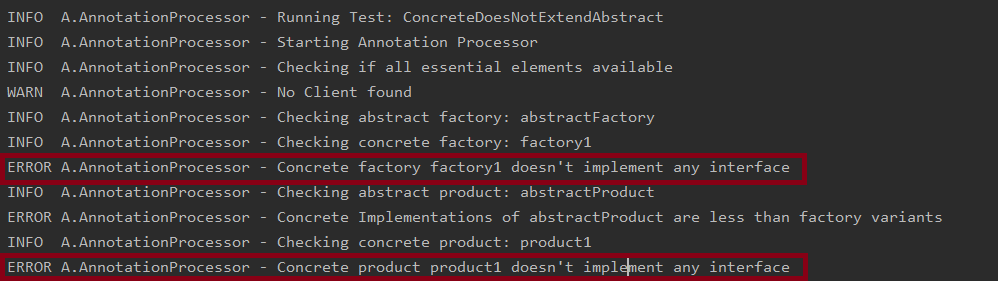
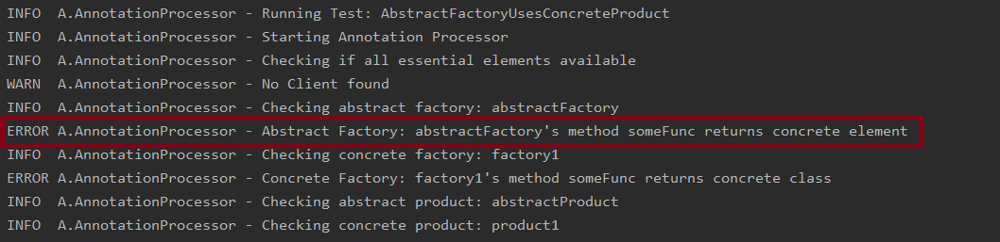

# Homework 2
### Description: object-oriented design and implementation of an annotation framework and a verifier for Abstract Factory Design Pattern.

## Overview
This project implements a design pattern verifier for abstract factory. It lets you know if you pattern doesn't follow the design rules using relevant warning and errors. It determines at compile time what entities are required for the design pattern and whether they are implemented correctly.

I have created annotations that would need to be put in correct positions e.g. on Abstract Factory etc. and the AnnotationProcessor (which extends AbstractProcessor) will take care of rest. I have made this annotations as minimal possible so the end user has to least amount of work. A log is also collect with different level messages about what the processor is doing and outputs all warnings and errors. Finally, I have written several tests using compile-test library by google that verifies this processor for some code.


## Abstract Factory

Abstract Factory is a creation design pattern that lets you produce families of related objects without specifying their concrete classes.

It helps us to entirely de-couple the client from the factory. Meaning the client doesn't need to know about any specific products. It only needs to know about the common interface that all these products and factories share. This also allows us to add new products or factories later without changing anything in the client. 

A great explanation of abstract factory can be found at [Refactoring Guru's Website.](https://refactoring.guru/design-patterns/abstract-factory). In this project, I have used the examples provided by refactoring guru to testing my Annotation processor. It can be tested with any other implementation given the code is annotated properly.

I read several resources to come up with every rule about Abstract Factory pattern. A summary of what I found was:-

#### Rules:
   -    Abstract Factory has 5 essential elements (AbstractFactory, ConcreteFactories, AbstractProducts, ConcreteProducts and Client. The Processor will only issue a warning is Client is not implemented, but if implemented, it will check for all possible errors. 
   -    Abstract Factory is implemented as an interface, and defines what methods Concrete Factories would have.
   -    Abstract Factory doesn't use any Concrete Product Type. It always uses Abstract Products.
   -    Each Concrete Factory is a Class that implements the interface of Abstract Factory. Java takes care of all overriding.
   -    Each Concrete Factory must also use Abstract Products for static types. 
   -    Each distinct product must have an interface
   -    Each concrete product must be a class.
   -	Each concrete product must extend this interface.
   -	Each abstract product is implemented in all given variants. 	
   -    Client should only deal with abstract factory and abstract products


## Project Structure 

The project is divided into 2 modules. The first module is **AnnotationProcessor** Module. This module has all the **Annotations** and **Processor**. The second module is called **Applications** and has the application defined inside.

It is preferred that if you implement design patterns in different modules. Make sure you add the following commands to the gradle dependencies of any new module as imports the AnnotationProcessor module and tell the application to run it.
```
compile project(':AnnotationProcessor')
annotationProcessor(project(':AnnotationProcessor'))
```


## Annotations

This application has 5 very simple annotations called:

   1. AbstractFactory
   2. ConcreteFactory
   3. AbstractProduct
   4. ConcreteProduct
   5. ClientAnnotation
   
As suggested by the name, you need to add these annotations of these elements. You can simple add an annotation with @ sign like this.

```java
@AbstractFactory
interface AbstractGUIFactory{
}
```
   
The first 4 annotations are necessary for the program. However, I noticed that although client is necessary but the rules amongst factory elements can be defined without it. Hence the Processor just gives a warning if nothing is annotated with client. But if you do annotate something with client, the Processor will make sure that no concrete class is used in that Client.

   
## AnnotationProcessor

The AnnotationProcessor implements the AbstractProcessor by java. It collects all elements annotated with supported annotations and uses them to verify the rules defined above.

The AnnotationProcessor tests for each rule for a given annotation one by one. The AnnotationProcessor can be found in AnnotationProcessor->src->main->java->AnnotationProcessor->AnnotationProcesser.java

The Annotation processor prints messages at different levels e.g. error, warning and notes to let the user know whats happening. It also logs all these output with exact name of elements that caused the error in log.log file which can be found in the root directory.

The code of AnnotationProcessor is well commented with the rules that it is trying to make sure are used correctly.


## Instructions

**Prerequisites**

- JVM and Gradle must be installed on your system.
- This project was done is Intellij Idea IDE. And can be easily loaded for proper project access.

**Running project using SBT**

- Clone or download this repository onto your system
- Open the Command Prompt (if using Windows) or the Terminal (if using Linux/Mac) and go to the project directory
- Build and compile the project and generate the jar file using gradle
```
./gradlew build
```
```
./gradlew compile
```

- To run tests use to following command
```
./gradlew test
```

**Running project using Intellij Idea**

- Clone or download this repository onto your system
- Go to the project and open it using Intellij, or open Intellij and go to file and load the project.
- You can run the project by running the WidgetApp in Applications module.
- You can run the tests by navigating tests in AnnotationProcessor Module. You can right click this folder and run all tests.


## Testing and Results

For writing tests for, I used JUnit and [Google's compile-testing library](https://github.com/google/compile-testing). 

I wrote 6 tests that check some correct or incorrect form of design pattern implemented. If the pattern is implemented correctly, the tests .compilesWithoutError() check and if it is supposed to give an error is uses .withErrorContaining( *Replace with the Error it is expecting to see!* )

1. AbstractFactoryNotInterface
2. ConcreteImplementationMissing
3. ConcreteDoesNotExtendAbstract
4. AbstractFactoryUsesConcreteProduct
5. BasicStructureCorrect
6. SimpleImplementation

Below are the results of two of these tests:-


#### ConcreteDoesNotExtendAbstract

Input:- Very basic implementation of factories and products in which concrete elements do not extent abstract elements:

```java
@AbstractFactory
interface abstractFactory{
}

@ConcreteFactory
class factory1{
}

@AbstractProduct
interface abstractProduct{
}

@ConcreteProduct
class product1{}
```

The output of the Processor for this program is:- 



    
       
#### AbstractFactoryUsesConcreteProduct

Input:- Very basic implementation of factories and products in which Abstract Factory uses a Concrete Product which is not allowed according to the rules.


```java
@AbstractFactory
interface abstractFactory{
    product1 someFunc();
}

@ConcreteFactory
class factory1 implements abstractFactory{
    @Override
    public product1 someFunc() {
        return new product1();
    }
}

@AbstractProduct
interface abstractProduct{
}

@ConcreteProduct
class product1 implements abstractProduct{
}
```

The output of the Processor for this program is:- 


